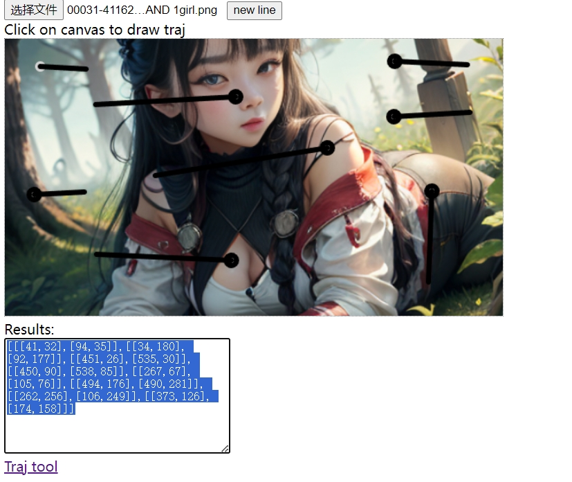
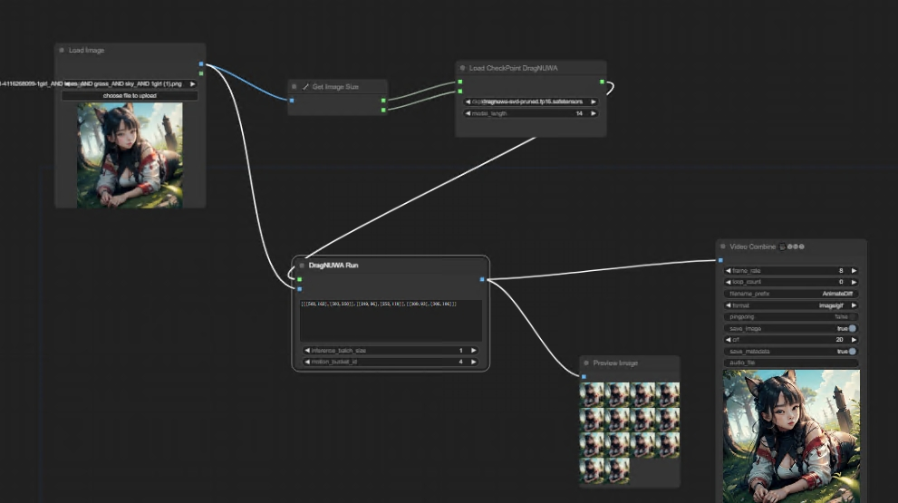
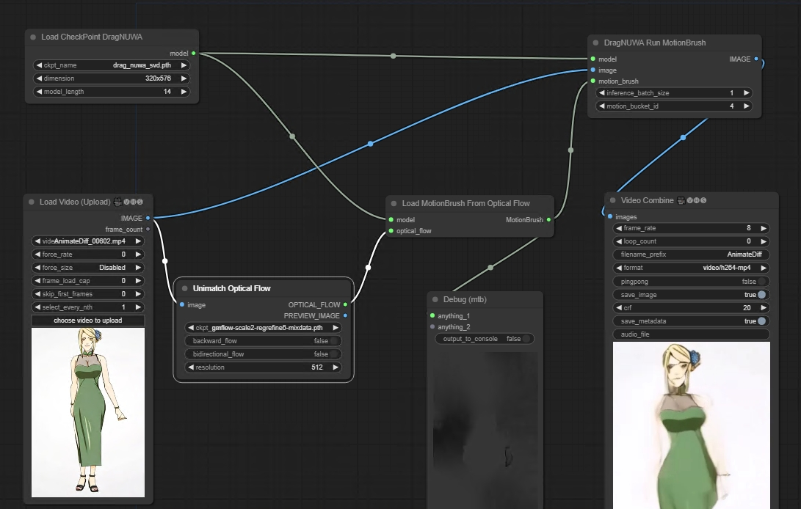

# This is an implementation of DragNUWA for ComfyUI

[DragNUWA](https://github.com/ProjectNUWA/DragNUWA): DragNUWA enables users to manipulate backgrounds or objects within images directly, and the model seamlessly translates these actions into camera movements or object motions, generating the corresponding video.

## Install

1. Clone this repo into custom_nodes directory of ComfyUI location

2. Run pip install -r requirements.txt

3. Download the weights of DragNUWA  [drag_nuwa_svd.pth](https://drive.google.com/file/d/1Z4JOley0SJCb35kFF4PCc6N6P1ftfX4i/view) and put it to `ComfyUI/models/checkpoints/drag_nuwa_svd.pth`

For chinese users:[drag_nuwa_svd.pth](https://www.liblib.art/modelinfo/e72699771a7b443499ffdd298f58f0a7)

smaller and faster fp16 model: [dragnuwa-svd-pruned.fp16.safetensors](https://huggingface.co/benjamin-paine/dragnuwa-pruned-safetensors/resolve/main/dragnuwa-svd-pruned.fp16.safetensors) from https://github.com/painebenjamin/app.enfugue.ai

For chinese users: `wget https://hf-mirror.com/benjamin-paine/dragnuwa-pruned-safetensors/resolve/main/dragnuwa-svd-pruned.fp16.safetensors` 不能直接在浏览器下载，或者参照 https://hf-mirror.com/ 官方使用说明

## Nodes

Two nodes `Load CheckPoint DragNUWA` & `DragNUWA Run`

## Tools

[Motion Traj Tool](https://chaojie.github.io/ComfyUI-DragNUWA/tools/draw.html) Generate motion trajectories

## Examples

1. base workflow

https://github.com/chaojie/ComfyUI-DragNUWA/blob/main/workflow.json

2. auto traj video generation (working on)

one flow: video -> dwpose -> keypoints -> trajectory -> DragNUWA (dragposecontrol animateanyone)

3. optical flow workflow

Thanks for Fannovol16's Unimatch_ OptFlowPreprocessor
Thanks for toyxyz's load optical flow from directory

https://github.com/chaojie/ComfyUI-DragNUWA/blob/main/workflow optical_flow.json

